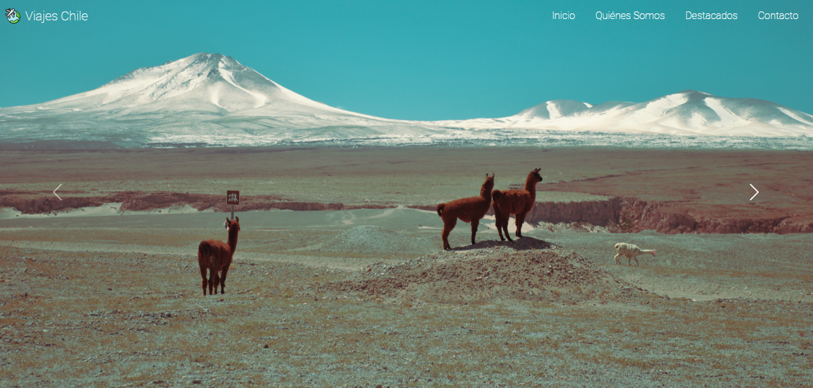
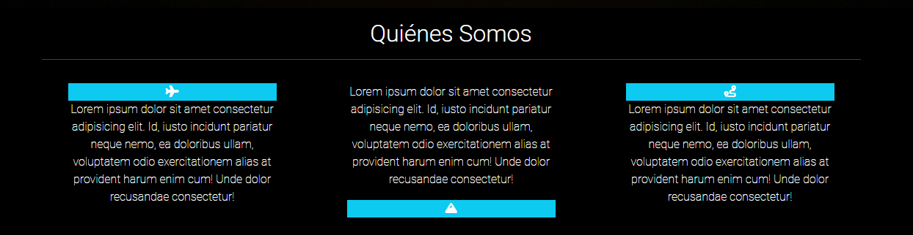
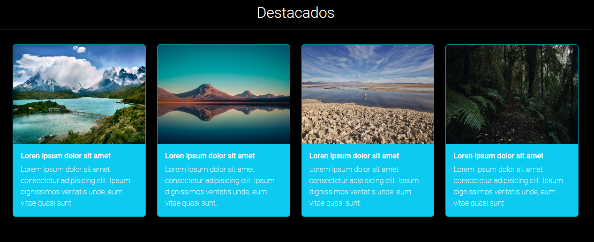
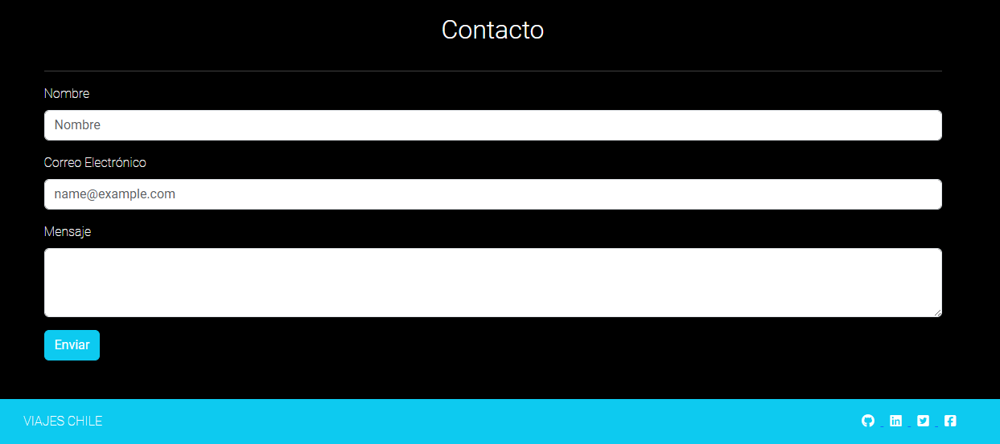

# Viajes Chile / Desafío Latam
> Prueba realizada en bootcamp de Talento Digital, Julio, 2024.

## Tabla de contenidos
* [Introducción](#introduccion)
* [Herramientas ocupadas](#herramientas)
* [Autor](#autor)
* [Contacto](#contacto)

## Introducción  
  ### Escribe aquí:
  - Nos pidieron realizar un landing page para una agencia de viajes, agregándole estilos y funcionalidades con la materia que hemos estudiado en el módulo 2 del bootcamp. Como requisito teneíamos que usar html5, css, bootstrap, JS y subir el repositorio a github.

## Herramientas ocupadas  
  ### Se intentó incorporar todos los requerimientos pedidos:
  HTML5
  - Para hacer la estructura y maqueta del proyecto.

  CSS
  - Para darle estilo y algunas funcionalidades como scrollsmooth.

  Bootstrap

  - Para darle algunas funcionalidades, como la responsividad, tamaños de cajas, textos, colores de fondos, etc.

   JS

  - Carrusel y tooltip.

  ¿Cómo se ve?
  - Así quedó la propuesta:
  
  
  
  

## Autor  
- Jazmín Meneses Díaz.

## Contacto 
- [linkedin](https://www.linkedin.com/in/jazminmeneses/)
